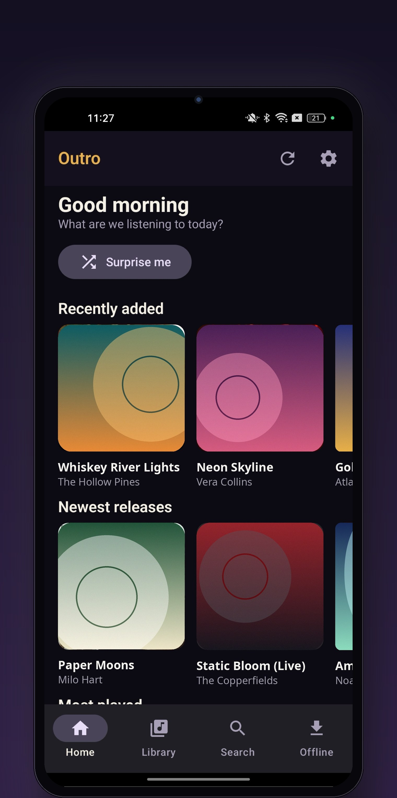
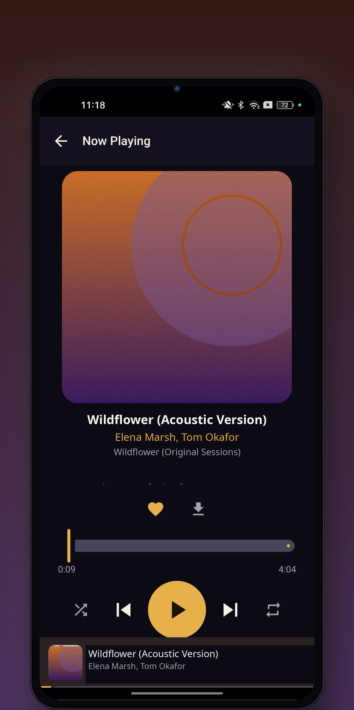
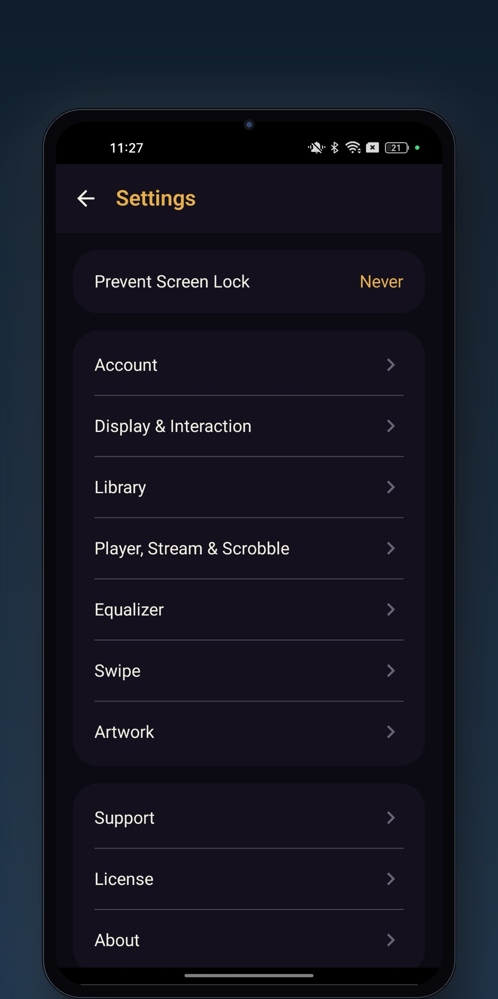

# Outro

A modern Android music client for **Subsonic**-compatible servers ([Navidrome](https://www.navidrome.org/), Airsonic, Gonic, …).

Dark or light themes, jazzy design. Apple Music-style polish. Smooth Jetpack Compose UI.

> Built and tested on a real device (Android 13), but **it may not be stable on all devices**. Bug reports, fixes, and improvements from the community are very welcome — that's why it's here.

<a href="https://apps.obtainium.imranr.dev/redirect?r=obtainium://app/%7B%22id%22%3A%22com.opus.music%22%2C%22url%22%3A%22https%3A%2F%2Fgithub.com%2Fjazzy1133%2Foutro%22%2C%22author%22%3A%22jazzy1133%22%2C%22name%22%3A%22Outro%22%7D"></a>

## Features

- **Full library browsing** — artists, albums, songs, genres, search
- **Dark and Light themes** — the classic jazzy dark look or a clean white theme, switchable in Settings
- **Now Playing** with queue management, shuffle, repeat
- **Smart Offline Mix** — auto-downloads your starred and most-played songs over Wi-Fi (25/50/100 songs, Wi-Fi-only option)
- **Party Queue** 🎉 — host a local Wi-Fi session; guests join via QR code, search the library, add songs, and vote. Host keeps playback control.
- **Smart Sleep Fade** — sleep timer with gradual volume fade (1/3/5/10 min), optional stop-at-end-of-track
- **Crossfade** between tracks (2–12 s, off by default)
- **Offline downloads** with cache management
- **Scrobbling**, streaming quality settings, gapless toggle, prevent-screen-lock options
- Amperfy-style grouped settings screen

## Screenshots

<p align="center">
  
  
  
</p>


## Requirements

- A Subsonic-compatible server (tested against Navidrome)
- Android 8.0 (API 26) or newer

## Building

This project uses a **manual build pipeline** (no Gradle wrapper checked in — the `build.gradle.kts` files are provided as reference; the working build is script-based):

**Prerequisites**

- JDK 17
- Android SDK with `platforms/android-34` and `build-tools/34.0.0`
- Kotlin 2.1.0 compiler (`kotlin-compiler-embeddable` 2.1.0 jar, plus the Compose compiler plugin for Kotlin 2.1.0)

**Steps**

```bash
# 1. Download all Maven dependencies (full transitive closure, ~119 artifacts)
python3 scripts/download_deps.py

# 2. Build the APK (compile Kotlin, aapt2 resources, D8 dex, zipalign, sign)
bash scripts/manual_build.sh

# 3. (Optional) run the static check suite against the APK
python3 scripts/test_108.py build-manual/apk/outro.apk
```

The scripts respect these environment variables if your tools live elsewhere:

| Variable | Default | Purpose |
|---|---|---|
| `OUTRO_PROJECT` | `~/workspace/outro` | Project checkout location |
| `JAVA_HOME` | `~/jdk/jdk-17.0.20.1+1` | JDK 17 |
| `ANDROID_SDK` | `~/android-sdk` | Android SDK |
| `KOTLINC_HOME` | `~/kotlinc/kotlin-2.1.0/kotlinc` | Kotlin compiler dist |
| `KOTLIN_EMBED_JAR` | `~/kplugins/embed/kotlin-compiler-embeddable-2.1.0.jar` | Embeddable compiler |
| `COMPOSE_PLUGIN` | `~/kplugins/kotlin-compose-compiler-plugin-embeddable-2.1.0.jar` | Compose compiler plugin |

The APK is signed with a **debug key** by default. For release builds, generate your own keystore and sign it yourself — never commit a keystore.

> **Known build quirk:** `androidx.lifecycle:lifecycle-livedata-core` is pinned to **2.7.0** in `scripts/download_deps.py` because D8 8.2.2 crashes (NPE) on 2.8.3's `LiveData$1.class`. Don't bump it without testing.

## Stability notes

- Tested primarily on one device (Oppo A96, Android 13). Other devices/OEM skins may behave differently — please report what you find.
- Party Queue needs a real Wi-Fi network; guest routers with client isolation will block it.
- Crossfade and sleep-fade timing can vary with buffering and audio focus; real-device feedback wanted.
- Equalizer and swipe-action settings are placeholders ("coming soon").

## Contributing

Contributions are welcome! Please see [CONTRIBUTING.md](CONTRIBUTING.md).

Good first areas: device-compatibility fixes, real-device testing reports, equalizer implementation, and Gradle build migration.

## License

MIT — see [LICENSE](LICENSE).
